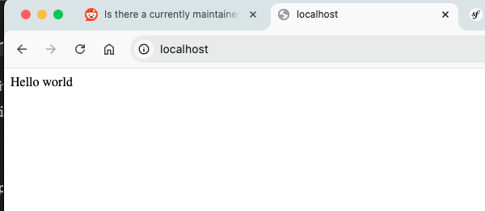

## Symfony 7.1, PHP 8.2 and mysql 8.0 with compose and symfony cli, ready for production ###


1. copy .env.example to .env, this file is required by docker compose to setup database access

2. 
```
docker compose up -d
#or
docker compose up --build -d # to rebuild


##shut down
docker compose down
```

## Volume Persistence ##
For local developement, db and filesystems persist via use of volume. Database lives in var/lib/mysql folder,
THere's phpmyadmin included for Database UI if needed. So unless you delete the /var folder, your database is safe.


```After docker compose up -d``` command

3. Open browser
http://localhost

4. Access mysql via phpmyadmin
http://localhost:3000 , see root user and password on .env file (no 1)

5. Continue as you would on a normal symfony project


6. Containers have been named for your convinience. Both symfony and composer reside in the container 'php'.

```
##command line
docker exec -it php /bin/bash
##ready for input
root@71e6cda46218:/var/www/html# 

#
composer 
##or
symfony 
```

Since this is a barebone symfony framework, here's two package we needed to install in order for the routing to work. 
1. Create server/config/routes/attributes.yaml and fill it up with the info
```yaml
#config/routes/attributes.yaml
controllers:
  resource:
    path: ../../src/Controller
    namespace: App\Controller
  type: attribute

kernel:
  resource: App\Kernel
  type: attribute
```

2. Controller
server/src/Controller/BlogController.php
```php
namespace App\Controller;

use Symfony\Component\HttpFoundation\Response;
use Symfony\Component\Routing\Annotation\Route;

class BlogController{
	#[Route('/', name: 'home_page')]
	public function list(): Response {
		return new Response('<html>Hello world</html>');
	}
}
```

```bash
composer require symfony/framework-bundle symfony/routing
```

open the browser now :  



## Murky waters ahead, you are on your own ##


